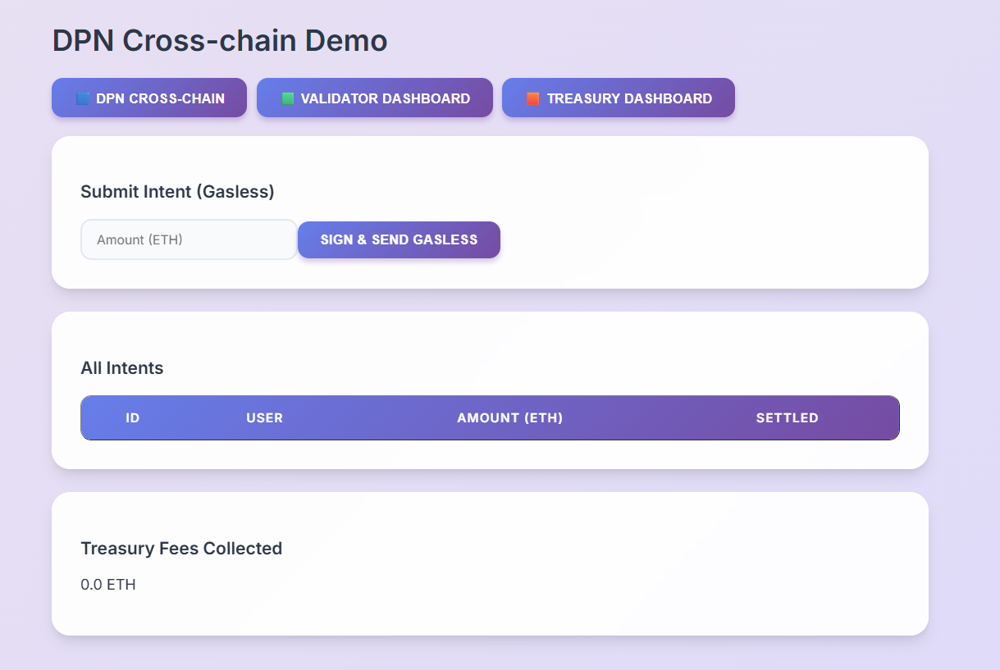
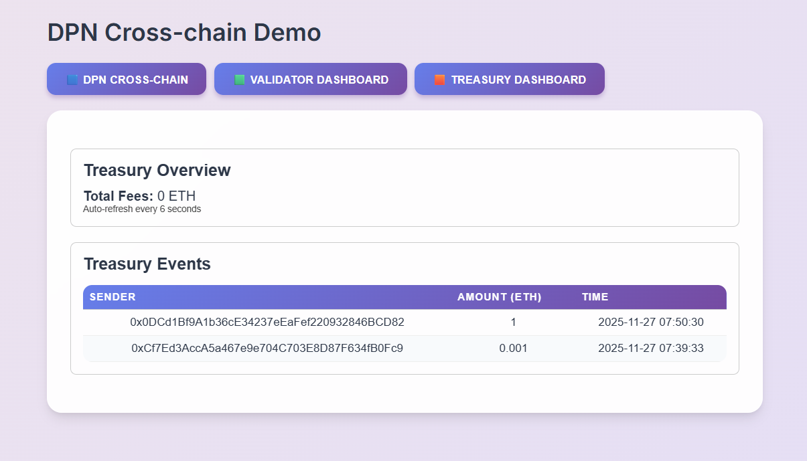

# DPN_by_ritesh_honule
# 🟦 DPN Cross-Chain Demo
### **A Decentralized, Intent-Driven, Cross-Chain Settlement & Liquidity Protocol**

This repository implements a fully functional prototype of a **permissionless cross-chain preconfirmation network**, a **solver-based liquidity coherence engine**, and a **cross-chain intent settlement system**.  
It combines **on-chain smart contracts** with **off-chain solver, relayer, validator, and indexer components**, demonstrating an end-to-end execution layer similar to **CoW Protocol**, **EigenLayer AVS**, **Across**, **1inch Fusion**, and **Circle CCTP** — but fully modular and backend-driven.

---

# ⚡ 1. High-Level Overview

This system demonstrates a decentralized execution network where:

---

## **👤 Users**
Submit intents (swaps, cross-chain actions) either:

- **On-chain**, or  
- **Gaslessly via EIP-712** signatures handled by the Relayer.

---

## **🤖 Solvers**
Off-chain bots compete in an auction to execute intents using:

- DEX pricing  
- Bridge fees  
- Routing strategies  
- Simulated cross-chain settlement  

---

## **🛡 Validators**
Validators stake collateral, monitor intents, and provide **preconfirmation guarantees**.

---

## **🏦 Treasury**
Automatically receives:

- **1% protocol fee** from intents  
- **Slashed validator funds**  

---

## **📊 Indexer**
Continuously listens to on-chain events and stores:

- Intents  
- Validators  
- Treasury snapshots  
- Slash events  
- Liquidity snapshots  

---

# 🔁 Execution Flow

User → IntentRegistry → Event → Solver → Auction → Winner → Settlement → Treasury

---

# 🔓 Permissionless Design

This entire system is **fully permissionless**:

- No API keys  
- No allowlists  
- Anyone can submit intents  
- Anyone can run a solver  
- Anyone can join as a validator  

---
## **📝 Intent Submission UI**

---
## **🛡 Validator Dashboard**


---
## **🏦 Treasury Dashboard**


## 📁 2. Folder Structure

The repository is organized into modular components for contracts, frontend, backend services, and testing.
```text
DPN-CROSSCHAIN-DEMO/
│
├── contracts/                   # All EVM smart contracts
│   ├── interfaces/              # Solidity Interfaces
│   ├── IntentRegistry.sol       # EIP-712 & Fee logic
│   ├── PreconfirmValidator.sol  # Preconf guarantees
│   ├── SlashController.sol      # Slashing logic
│   ├── SolverAuction.sol        # Auction mechanism
│   ├── StakingManager.sol       # Fund management
│   ├── Treasury.sol             # Fee collection
│   └── ValidatorRegistry.sol    # Node management
│
├── diagrams/                    # Architecture & Flow PNGs
├── docs/                        # Technical documentation
│
├── frontend/                    # React UI
│   ├── src/
│   │   ├── components/          # IntentForm, ValidatorDashboard, etc.
│   │   ├── utils/               # Contract loaders & helpers
│   │   └── App.js
│   └── ...
│
├── indexer/                     # SQL-based event indexer
│   ├── indexer.js
│   ├── eventsWatcher.js
│   ├── liquidityCollector.js
│   └── schema.sql
│
├── relayer/                     # Gasless meta-transaction server
│   ├── relayer_server.js
│   └── chainA.js / chainB.js
│
├── scripts/                     # Deployment & Simulation scripts
│   ├── deploy.js
│   ├── submit_intent.js
│   ├── slash_interactive.js
│   └── ...
│
├── server/                      # Backend coordinators
│   ├── auction_coordinator.js
│   └── indexerApi.js
│
├── solver/                      # Core solver engine
│   ├── pricing/                 # DEX & Bridge pricing strategies
│   ├── auctionClient.js
│   └── solver.js
│
├── test/                        # Hardhat unit tests
│   ├── auction.test.js
│   ├── intent.test.js
│   └── treasury.test.js
│
├── validator/                   # Validator node logic
│   ├── keys/
│   └── validator.js
│
├── hardhat.config.js
└── README.md
```

# 🔧 3. Smart Contract Architecture

This protocol uses a modular set of EVM smart contracts that handle intent storage, solver bidding, validator staking, slashing, and protocol fee capture.

---

## **📘 IntentRegistry.sol**
- Stores all submitted intents  
- Handles **EIP-712 gasless intent flows**  
- Emits `IntentSubmitted` events  
- Forwards **1% preconfirmation fee** to the Treasury  
- Allows marking intents as settled via `markSettled()`  

---

## **⚔️ SolverAuction.sol**
- Receives solver bids for each intent  
- Selects the **lowest (best) bid**  
- Stores solver commitments & auction state  

---

## **🏦 Treasury.sol**
- Receives protocol fees from intents  
- Receives slashed validator stake  
- Maintains **immutable accounting** of `totalFees`  

---

## **🛡 ValidatorRegistry.sol**
- Registers validators  
- Manages validator stake amounts  
- Supports deactivation, withdrawal cooldown, and slashing  

---

## **🧩 PreconfirmValidator.sol**
- Provides hooks for **off-chain validator preconfirmations**  
- Used by relayers and solvers during settlement workflows  

---

## **💰 StakingManager.sol**
- Manages movement of validator staking funds  
- Implements slashing logic and forwards slashed amounts to the Treasury  

---
# 🖥 4. Frontend UI (React)

The frontend is a lightweight React application that provides a complete interface for interacting with the intent protocol. It connects directly to on-chain contracts, the indexer API, and the relayer.

---

## **✨ Key Features**

### **✔ Gasless Intent Submission**
Users sign EIP-712 structured messages, which are sent to the Relayer.  
The relayer submits the on-chain transaction, and the UI displays the resulting `txHash`.

---

### **✔ Intent Table**
Real-time display of submitted and settled intents using data from:
- On-chain contract reads  
- Indexer snapshots (`/intents` API)

---

### **✔ Validator Dashboard**
Interactive validator lifecycle management:
- Register  
- Stake  
- Top-up stake  
- Deactivate  
- Withdraw with cooldown enforcement  
- View slash events pulled from indexer history  

---

### **✔ Treasury Dashboard**
Shows:
- Total protocol fees collected  
- Data fetched from the indexer’s `/treasury/total` endpoint  

---

## **🧰 Frontend Tech Stack**
The frontend is built using:
- **React.js**
- **ethers.js** for blockchain interaction  
- Local ABIs synced via deployment scripts  
- Auto-loaded on-chain addresses for seamless contract instantiation  

---
# 🌐 5. Relayer (Gasless Meta-Transactions)

**Location:** `relayer/relayer_server.js`

The relayer enables fully gasless user interactions by handling EIP-712 intent submissions and forwarding them on-chain.

### **Responsibilities**
- Accept EIP-712–signed intent payloads  
- Validate intent structure and signature fields  
- Pay blockchain gas using the relayer’s private key  
- Call `relaySubmitIntent()` on the IntentRegistry  
- Return the resulting `txHash` and metadata to the frontend  

### **API Endpoint**

The relayer is **fully permissionless** — any user or application can submit intents through it without API keys or whitelisting.

---

# 🗄 6. Indexer (Real-Time SQL Engine)

**Location:** `indexer/indexer.js`

The indexer continuously listens to on-chain events and stores protocol data in a local SQLite database for fast API-level access and frontend rendering.

### **Tracks**
- `IntentSubmitted` events  
- `IntentSettled` events  
- Validator registration, activation, deactivation, and withdrawals  
- Slash events and staking impacts  
- Treasury deposits and total fee accumulation  
- Liquidity snapshots from simulated DEX/bridge collectors  

The indexer exposes high-speed API endpoints through:  
`server/indexerApi.js` — enabling instant access to intents, validators, treasury totals, and slashing history.

---

# 🔥 7. Solver Engine

**Location:**  
- `solver/solver.js`  
- `solver/auctionClient.js`

The Solver Engine is the core off-chain execution component of the protocol. Solvers monitor new intents, compute optimal pricing routes, and bid competitively in the SolverAuction contract.

### **Capabilities**
- Listens for new `IntentSubmitted` events  
- Computes mock DEX output + bridge fee estimates  
- Submits solver bids to the Auction contract  
- Uses modular pricing and routing strategies defined in:
  - `pricing/`
  - `strategies/`

### **Auction Selection**
- The auction selects the solver with the **lowest bond (best bid)**  
- The winning solver proceeds to execute simulated settlement  
- Settlement is finalized on-chain via `markSettled()`  

---

# ⚔️ 8. Validator Node

**Location:** `validator/validator.js`

The validator node simulates a decentralized validator network responsible for preconfirmation guarantees and security enforcement.

### **Capabilities**
- Listens to newly submitted intents  
- Prints and logs validator preconfirmation activity  
- Can be extended to sign real cryptographic commitments  
- Validator staking, deactivation, withdrawal, and slashing  
  are fully managed through the on-chain **ValidatorRegistry** contract  

---


# 🧪 10. Tests (Hardhat)

The test suite covers:

- **Auction best-bid logic**  
- **Intent submission + protocol fee forwarding**  
- **Treasury fee accumulation and accounting integrity**  

---

# 🧩 11. System Highlights

### ✔ Full Intent Framework
End-to-end flow from **EIP-712 signing → on-chain submission → solver auction → settlement**.

### ✔ Permissionless Solver Network
Anyone can run a solver bot and compete freely in auctions.

### ✔ Decentralized Validator Model
Validator **staking**, **slashing**, and **preconfirmation guarantees** enforced via the `ValidatorRegistry`.

### ✔ Liquidity Coherence Engine
Simulated DEX + bridge pricing with modular routing strategies.

### ✔ Gasless UX
Relayer handles all **meta-transactions**, enabling fully gasless intent submission.

### ✔ Real Indexer
SQLite-backed indexer with API endpoints powering live dashboards and analytics.

### ✔ Treasury Auto-Fee Capture
Immutable fee routing ensures **protocol revenue** from every intent.

---


# 🎥 12. Demo Video (Add Link)

_Add your Loom / YouTube demo link here once recorded._

---


## 🚀 4. HOW TO RUN THE PROJECT 

Below is the exact sequence to run the entire decentralized network from scratch.

---

## 📦 4.1 Install Dependencies

npm install
cd frontend && npm install

## 📦 4. Install Hardhat Dependencies
npm install --save-dev hardhat @nomiclabs/hardhat-ethers ethers chai

## ⚙️ 4.2 Start Hardhat Local Blockchain
# Terminal 1
npx hardhat node
# (Starts a local EVM chain with 20 funded accounts)

## 🛠 4.3 Compile Contracts
npx hardhat compile

## 📜 4.4 Deploy Core Contracts
# Terminal 2
npx hardhat run scripts/deploy.js --network localhost
# (Outputs deployed addresses into scripts/helper/addresses.json)


## 🔄 4.6 Start the Indexer (SQLite + Events)
# Terminal 3
node indexer/indexer.js

# Expected output:
📦 DB ready
🔗 Indexer connected — waiting for events...
📡 Indexer API running at http://127.0.0.1:4200

# Indexer tracks:
- intents
- validator events
- slashes
- treasury income
- liquidity snapshots


## 🔁 4.7 Start the Relayer (Gasless Engine)
# Terminal 4
node relayer/relayer_server.js
# Expected logs:
Relayer listening on http://127.0.0.1:4000

# Ready for signed intents


## 🧠 4.8 Start Solver Auction Simulator
# Terminal 5
node solver/auctionClient.js
# Simulates competing off-chain solvers.


## 🖥 4.10 Start the Frontend UI
# Terminal 7
cd frontend
npm install
npm start

# Visit:
http://localhost:3000

# UI displays:
- Gasless Intent Submission
- Validator Dashboard
- Treasury Overview
- Slash History
- Liquidity Snapshots


## ✔ A. Submit a Gasless Intent
# UI → Intent Page
# OR terminal:
npx hardhat run scripts/submit_intent.js --network localhost
# Relayer settles → Indexer stores → UI updates.


## ✔ B. Register as Validator
Go to Validator Dashboard → Stake & Register


## ✔ C. Deactivate → Wait 10s → Withdraw
Click Deactivate
Wait 10 seconds
Click Withdraw


## ✔ D. Slash a Validator (click topup)
# Admin command:
npx hardhat run scripts/slash_interactive.js --network localhost
# Slash appears in UI + database.


## 🏁 6. End-to-End Verification
✔ Fully decentralized validator network
✔ SQL-backed real-time indexer
✔ Gasless EIP-712 intent submission
✔ Cross-chain solver auction
✔ Automated treasury fee logic
✔ Staking, cooldown & withdrawals
✔ Slashing & audit tracking
✔ Complete React dashboards


# 🏁 13. About the Author

# **Ritesh Honule**  
Full Stack Web3 Engineer
